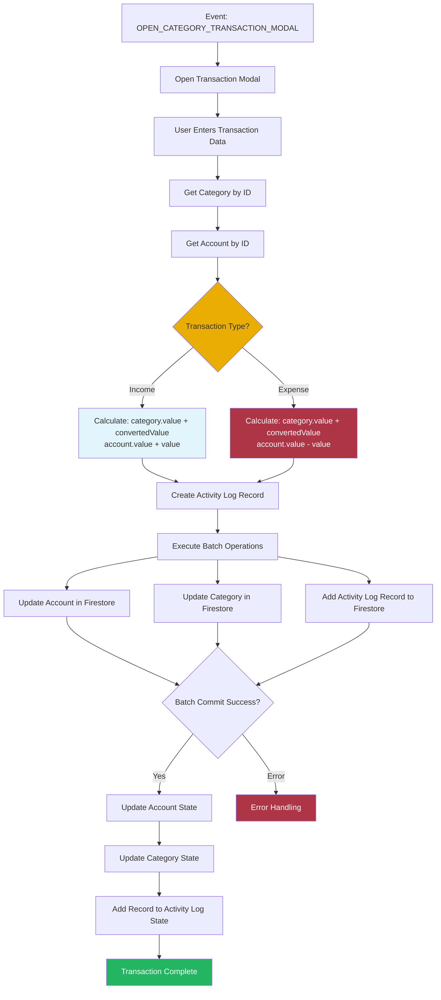

# Category Transaction Orchestrator

This orchestrator handles category transaction workflows, coordinating updates between categories, accounts, and activity log when users add income or expense transactions.

## Overview

The Category Transaction Orchestrator manages the complex workflow of adding transactions to categories. It ensures that category values, account balances, and activity log records are updated consistently when a transaction is recorded.

## Responsibilities

- Open category transaction modal
- Process transaction data (category, account, value, note)
- Update category value
- Update account balance (income increases, expense decreases)
- Create activity log record
- Maintain data consistency across domains

## Workflow



## Event Handling

### Listens For

- `CategoryEvents.OPEN_CATEGORY_TRANSACTION_MODAL`

### Event Payload

```typescript
interface OpenCategoryTransactionModalEvent {
  categoryId: string;
}
```

## Dependencies

- **Category Domain**: Category data and updates
- **Account Domain**: Account data and balance updates
- **Activity Log Domain**: Transaction record creation
- **BatchOperationService**: Database transaction management
- **EventBusService**: Event communication

## Transaction Logic

### Income Transactions

- Category value: `category.value + convertedValue`
- Account balance: `account.value + value` (increases)

### Expense Transactions

- Category value: `category.value + convertedValue`
- Account balance: `account.value - value` (decreases)

## Batch Operations

The orchestrator performs three Firestore operations in a single batch:

1. **Update Account**: Modify account balance
2. **Update Category**: Modify category value
3. **Add Activity Log Record**: Create transaction record

All operations must succeed or all are rolled back.

## Error Handling

- Catches errors during transaction processing
- Throws descriptive error messages
- Maintains data integrity on failure

## Usage

This orchestrator is automatically initialized when the dashboard loads and listens for transaction modal events throughout the application lifecycle.
