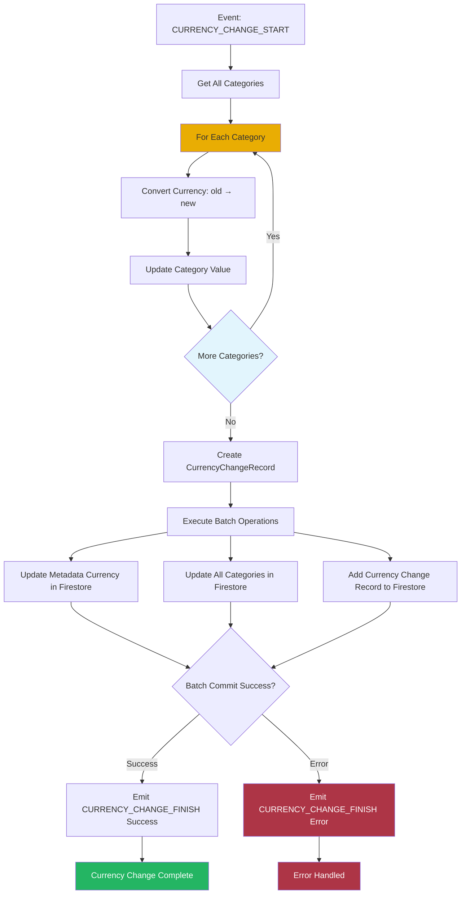

# Currency Change Orchestrator

This orchestrator handles currency change workflows, updating category values, metadata, and activity log when users switch their display currency.

## Overview

The Currency Change Orchestrator coordinates the complex process of changing the user's display currency. It ensures that all category values are converted correctly, metadata is updated, and a currency change record is created in the activity log.

## Responsibilities

- Listen for currency change events
- Convert all category values to new currency
- Update metadata with new currency
- Create currency change activity log record
- Maintain data consistency across domains

## Workflow



## Event Handling

### Listens For

- `MetadataEvents.CURRENCY_CHANGE_START`

### Event Payload

```typescript
interface CurrencyChangeEvent {
  newCurrency: CurrenciesEnum;
}
```

### Emits

- `MetadataEvents.CURRENCY_CHANGE_FINISH` (success or error)

## Dependencies

- **Metadata Domain**: Currency conversion and metadata updates
- **Category Domain**: Category data and value updates
- **Activity Log Domain**: Currency change record creation
- **BatchOperationService**: Database transaction management
- **EventBusService**: Event communication

## Currency Conversion

### Conversion Process

1. Get all categories from store
2. For each category:
   - Get current currency from metadata
   - Convert value from current currency to new currency
   - Update category with converted value
3. All conversions use exchange rates from metadata service

### Batch Operations

The orchestrator performs three Firestore operations in a single batch:

1. **Update Metadata**: Set new currency
2. **Update Categories**: Update all category values with converted amounts
3. **Add Activity Log Record**: Create currency change record

All operations must succeed or all are rolled back.

## Error Handling

- Catches errors during currency conversion
- Emits error event with error code
- Maintains data integrity on failure
- Provides user feedback via event bus

## State Updates

After successful batch operation:
- Category values converted in Firestore
- Currency change recorded in activity log
- Success event emitted for UI feedback

## Usage

This orchestrator is automatically initialized when the dashboard loads and listens for currency change events throughout the application lifecycle.
