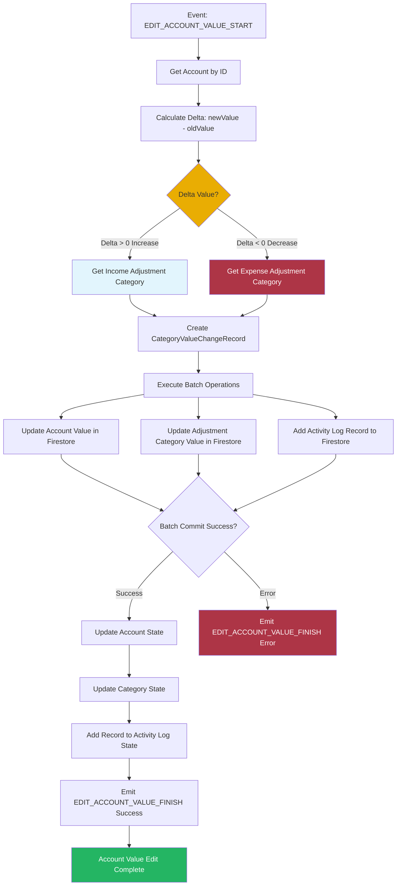

# Edit Account Value Orchestrator

This orchestrator handles account value editing workflows, updating account balances and creating adjustment transactions when users manually modify account values.

## Overview

The Edit Account Value Orchestrator manages the process of manually editing account balances. It ensures that account values are updated correctly and creates appropriate adjustment category transactions to maintain transaction history.

## Responsibilities

- Listen for account value edit events
- Calculate value difference (delta)
- Determine adjustment category (income or expense)
- Update account balance
- Update adjustment category value
- Create activity log record
- Maintain data consistency

## Workflow



## Event Handling

### Listens For

- `AccountEvents.EDIT_ACCOUNT_VALUE_START`

### Event Payload

```typescript
interface EditAccountValueEvent {
  accountId: string;
  value: number;      // New account value
  note: string;       // Optional note/description
}
```

### Emits

- `AccountEvents.EDIT_ACCOUNT_VALUE_FINISH` (success or error)

## Dependencies

- **Account Domain**: Account data and balance updates
- **Category Domain**: Adjustment category data and updates
- **Activity Log Domain**: Transaction record creation
- **BatchOperationService**: Database transaction management
- **EventBusService**: Event communication

## Adjustment Logic

### Value Change Calculation

```typescript
delta = newValue - oldValue
absDelta = Math.abs(delta)
```

### Category Selection

- **If delta > 0** (value increased): Use Income Adjustment Category
- **If delta < 0** (value decreased): Use Expense Adjustment Category

### Updates

- **Account**: Set to new value (`event.payload.value`)
- **Adjustment Category**: Add absolute delta (`category.value + absDelta`)
- **Activity Log**: Record created with adjustment details

## Batch Operations

The orchestrator performs three Firestore operations in a single batch:

1. **Update Account**: Set new account value
2. **Update Adjustment Category**: Increase category value by absolute delta
3. **Add Activity Log Record**: Create adjustment transaction record

All operations must succeed or all are rolled back.

## Error Handling

- Catches errors during account value editing
- Emits error event with error code
- Maintains data integrity on failure
- Provides user feedback via event bus

## State Updates

After successful batch operation:
- Account state updated with new value
- Adjustment category state updated
- Activity log record added to state
- Success event emitted for UI feedback

## Usage

This orchestrator is automatically initialized when the dashboard loads and listens for account value edit events throughout the application lifecycle.
