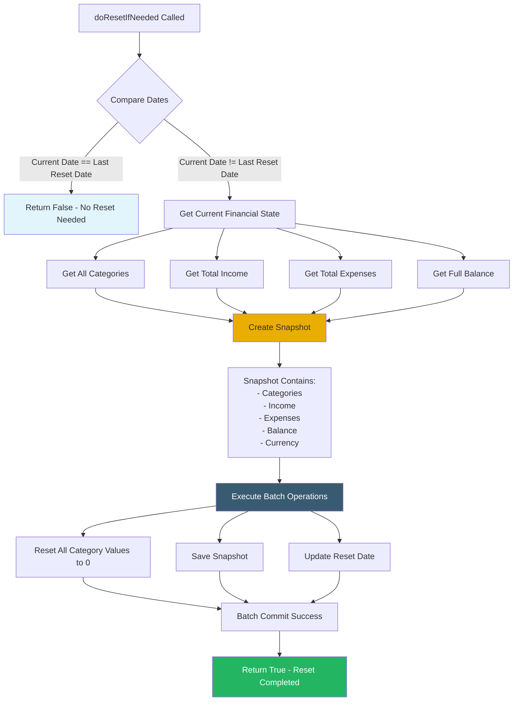

# Month Reset Orchestrator

This orchestrator handles automatic monthly reset operations, creating financial snapshots and resetting category values at the start of each new month.

## Overview

The Month Reset Orchestrator manages the automated monthly financial reset process. It checks if a reset is needed based on the current date and the last reset date, then creates a snapshot of the previous month's financial state and resets all categories to zero.

## Responsibilities

- Check if month reset is needed
- Create monthly financial snapshot
- Reset all category values to zero
- Update metadata with new reset date
- Maintain historical financial data

## Workflow



## Method

### doResetIfNeeded()

**Purpose**: Check and perform month reset if needed

**Returns**: `Promise<boolean>`
- `true` if reset was performed
- `false` if reset was not needed

**Logic**:
1. Compare current month/year with last reset date
2. If same month → return false (no reset needed)
3. If different month → proceed with reset

## Reset Process

### Snapshot Creation

The orchestrator creates a complete snapshot containing:

- **Date**: Previous month timestamp
- **Categories**: All categories with their values
- **Income**: Total income for the month
- **Expenses**: Total expenses for the month
- **Month Balance**: Net balance (income - expenses)
- **Full Balance**: Total account balance at snapshot time
- **Currency**: Currency at snapshot time

### Category Reset

All category values are reset to zero:
- Income categories → 0
- Expense categories → 0
- System categories → 0

### Metadata Update

The reset date in metadata is updated to the current month/year.

## Batch Operations

The orchestrator performs three Firestore operations in a single batch:

1. **Update Categories**: Reset all category values to 0
2. **Update Snapshots**: Save monthly snapshot
3. **Update Metadata**: Update reset date

All operations must succeed or all are rolled back.

## Dependencies

- **Metadata Domain**: Reset date and currency information
- **Category Domain**: Category data and value updates
- **Account Domain**: Account balance calculations
- **Snapshot Domain**: Snapshot creation and storage
- **BatchOperationService**: Database transaction management

## Automatic Execution

### When Called

- On dashboard initialization
- After all domain data is loaded
- Automatically checks if reset is needed

### Timing

- Runs once per month automatically
- Based on month/year comparison
- User gets notification if snapshot created

## Error Handling

- Handled at dashboard level
- Errors display user-friendly messages
- Application continues to function on error

## Usage Example

```typescript
// Called from DashboardComponent after data loading
const result = await this.monthResetOrchestratorService.doResetIfNeeded();

if (result) {
  // Snapshot was created
  this.snackbarHandlerService.showMessageSnackbar('messages.monthSnapshotCreated');
}
```
