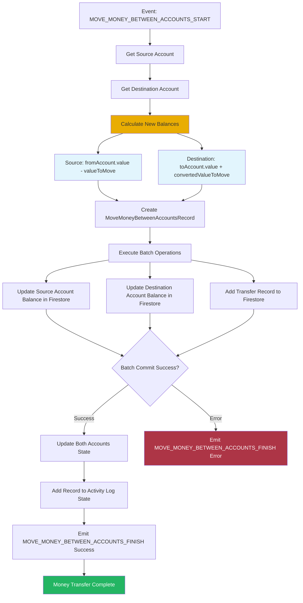

# Move Money Between Accounts Orchestrator

This orchestrator handles money transfer workflows between accounts, updating account balances and creating transfer records when users move money between different accounts.

## Overview

The Move Money Between Accounts Orchestrator manages the process of transferring money from one account to another. It handles currency conversion if accounts use different currencies and ensures both account balances are updated correctly.

## Responsibilities

- Listen for money movement events
- Get source and destination accounts
- Calculate new account balances
- Handle currency conversion
- Update both account balances
- Create transfer activity log record
- Maintain data consistency

## Workflow



## Event Handling

### Listens For

- `AccountEvents.MOVE_MONEY_BETWEEN_ACCOUNTS_START`

### Event Payload

```typescript
interface MoveMoneyBetweenAccountsEvent {
  fromAccountId: string;
  toAccountId: string;
  valueToMove: number;              // Amount in source account currency
  convertedValueToMove: number;      // Amount in destination account currency
}
```

### Emits

- `AccountEvents.MOVE_MONEY_BETWEEN_ACCOUNTS_FINISH` (success or error)

## Dependencies

- **Account Domain**: Account data and balance updates
- **Activity Log Domain**: Transfer record creation
- **BatchOperationService**: Database transaction management
- **EventBusService**: Event communication

## Transfer Logic

### Balance Calculations

**Source Account (From)**:
```typescript
fromAccountNewValue = fromAccount.value - valueToMove
```

**Destination Account (To)**:
```typescript
toAccountNewValue = toAccount.value + convertedValueToMove
```

### Currency Conversion

- `valueToMove`: Amount in source account currency
- `convertedValueToMove`: Amount already converted to destination account currency
- Conversion handled before orchestrator (in AccountService)

## Batch Operations

The orchestrator performs three Firestore operations in a single batch:

1. **Update Source Account**: Decrease balance by transfer amount
2. **Update Destination Account**: Increase balance by converted amount
3. **Add Activity Log Record**: Create transfer record

All operations must succeed or all are rolled back.

## Activity Log Record

The transfer creates a `MoveMoneyBetweenAccountsRecord` containing:
- Source account information
- Destination account information
- Amount in source currency
- Amount in destination currency
- Transfer timestamp

## Error Handling

- Catches errors during transfer processing
- Emits error event with error code
- Maintains data integrity on failure
- Provides user feedback via event bus

## State Updates

After successful batch operation:
- Both account states updated with new balances
- Activity log record added to state
- Success event emitted for UI feedback

## Data Consistency

- Atomic operations via batch commit
- Both accounts updated together
- Transfer record created simultaneously
- No partial updates possible

## Usage

This orchestrator is automatically initialized when the dashboard loads and listens for money movement events throughout the application lifecycle.
