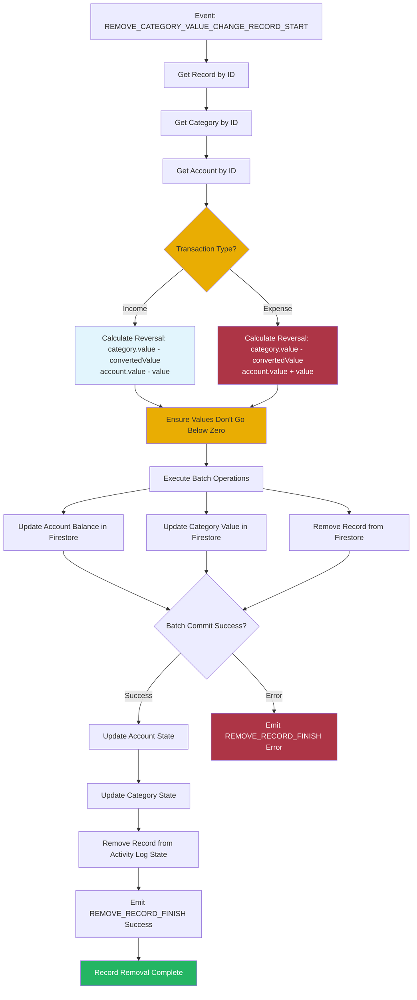

# Remove Activity Log Record Orchestrator

This orchestrator handles the removal of category transaction records from the activity log, reversing the transaction's effects on categories and accounts.

## Overview

The Remove Activity Log Record Orchestrator manages the process of deleting transaction records. When a user removes a transaction, it reverses the transaction's effects on the associated category and account, ensuring data consistency.

## Responsibilities

- Listen for record removal events
- Get the activity log record to remove
- Get associated category and account
- Reverse transaction effects
- Update category value
- Update account balance
- Remove record from activity log
- Maintain data consistency

## Workflow



## Event Handling

### Listens For

- `ActivityLogEvents.REMOVE_CATEGORY_VALUE_CHANGE_RECORD_START`

### Event Payload

```typescript
interface RemoveCategoryValueChangeRecordEvent {
  recordId: string;
}
```

### Emits

- `ActivityLogEvents.REMOVE_CATEGORY_VALUE_CHANGE_RECORD_FINISH` (success or error)
  - Includes `operationId` for correlation

## Dependencies

- **Activity Log Domain**: Record data and removal
- **Category Domain**: Category data and value updates
- **Account Domain**: Account data and balance updates
- **BatchOperationService**: Database transaction management
- **EventBusService**: Event communication

## Reversal Logic

### Value Reversal

The orchestrator reverses the original transaction effects:

#### Income Transaction Reversal
- **Category**: `category.value - record.convertedValue`
- **Account**: `account.value - record.value` (decrease)

#### Expense Transaction Reversal
- **Category**: `category.value - record.convertedValue`
- **Account**: `account.value + record.value` (increase, reversing the decrease)

### Zero Protection

Values are prevented from going below zero:
```typescript
// Category
updatedValue = Math.max(0, category.value - convertedValue)

// Account (Income)
updatedValue = Math.max(0, account.value - record.value)

// Account (Expense)
updatedValue = account.value + record.value  // Always increases
```

## Batch Operations

The orchestrator performs three Firestore operations in a single batch:

1. **Update Account**: Reverse account balance change
2. **Update Category**: Reverse category value change
3. **Remove Record**: Delete activity log record (using `deleteField()`)

All operations must succeed or all are rolled back.

## Record Type

Currently handles:
- `CategoryValueChangeRecord`: Regular income/expense transactions

Other record types (currency change, category reset, money transfer) may not support removal.

## Error Handling

- Catches errors during record removal
- Emits error event with error code and operation ID
- Maintains data integrity on failure
- Provides user feedback via event bus

## State Updates

After successful batch operation:
- Account state updated with reversed balance
- Category state updated with reversed value
- Activity log record removed from state
- Success event emitted with operation ID for correlation

## Data Consistency

- Atomic operations via batch commit
- Account, category, and record updated together
- No partial updates possible
- Zero protection prevents negative values

## Usage

This orchestrator is automatically initialized when the dashboard loads and listens for record removal events throughout the application lifecycle.
