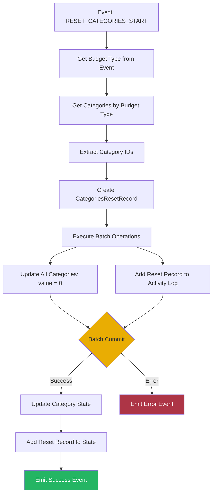

# Reset Categories Orchestrator

This orchestrator handles category reset workflows, resetting all category values of a specific budget type (income or expense) to zero and creating a reset record in the activity log.

## Overview

The Reset Categories Orchestrator manages the process of resetting category values to zero. It can reset all income categories or all expense categories, creating an activity log record to track the reset operation.

## Responsibilities

- Listen for category reset events
- Get all categories by budget type
- Reset category values to zero
- Create reset activity log record
- Update category state
- Maintain data consistency

## Workflow



## Event Handling

### Listens For

- `CategoryEvents.RESET_CATEGORIES_START`

### Event Payload

```typescript
interface ResetCategoriesEvent {
  budgetType: BudgetType;  // Income or Expense
}
```

### Emits

- `CategoryEvents.RESET_CATEGORIES_FINISH` (success or error)

## Dependencies

- **Category Domain**: Category data and value updates
- **Activity Log Domain**: Reset record creation
- **BatchOperationService**: Database transaction management
- **EventBusService**: Event communication

## Reset Process

### Category Selection

The orchestrator resets all categories of the specified budget type:
- **Income Categories**: All income categories set to 0
- **Expense Categories**: All expense categories set to 0

### Category IDs Extraction

```typescript
categoriesIdsToReset = categories
  .filter(category => category.budgetType === budgetType)
  .map(category => category.id)
```

### Value Reset

All selected category values are reset to zero:
```typescript
categoriesIdsToReset.forEach(id => {
  updateDoc(categoryDocRef, { [`${id}.value`]: 0 })
})
```

## Batch Operations

The orchestrator performs two Firestore operations in a single batch:

1. **Update Categories**: Reset all category values of the specified type to 0
2. **Add Activity Log Record**: Create categories reset record

All operations must succeed or all are rolled back.

## Activity Log Record

The reset creates a `CategoriesResetRecord` containing:
- Budget type (Income or Expense)
- Reset timestamp
- Record type identifier
- Appropriate icon based on budget type

## State Updates

After successful batch operation:
- All affected category states updated with value = 0
- Reset record added to activity log state
- Success event emitted for UI feedback

## Error Handling

- Catches errors during reset processing
- Emits error event with error code
- Maintains data integrity on failure
- Provides user feedback via event bus

## Usage

This orchestrator is automatically initialized when the dashboard loads and listens for category reset events throughout the application lifecycle. Typically triggered when users manually reset categories for a specific budget type.
